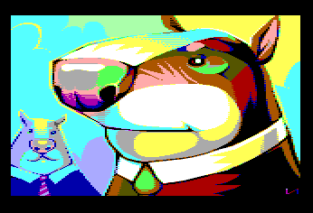

# ESP32TinyEmudore C64
First progress and basic template of the port of Mario Ballano's PC x86 emudore (C64) emulator to ESP32.

<ul>
 <li><a href='https://discord.gg/fMCVWrUqNU'><b>Discord:</b> https://discord.gg/fMCVWrUqNU</a></li>
 <li><a href='https://www.youtube.com/watch?v=4KDN5DaNtIk'><b>Youtube:</b> https://www.youtube.com/watch?v=4KDN5DaNtIk</a></li>
 <li><a href='https://retrowiki.es/viewforum.php?f=114'><b>Forum: </b>https://retrowiki.es/viewforum.php?f=114</a></li>
</ul>

<h1>Documentacion (Help)</h1>

<ul>
 <li>Runs on ESP32 520 KB SRAM (TTGO VGA32 v1.2)</li>
 <li>Use of SRAM, no use of PSRAM</li>
 <li>VGA 400x300 Tiny VGA bitluni (Ricardo Massaro mod)</li>
 <li>Project compatible with Arduino IDE and Platform IO</li>
 <li>Load PRG</li>
 <li>Use of the remote keyboard via UART (TAB or F2 show OSD) 115200 bauds</li>
 <li>Select PRG from the OSD and type RUN from the BASIC.</li>
</ul>
